  

  

  

  

<strong>ROHULLAH REZAI</strong> · AI ENGINEER · FOUNDER · FULL-STACK DEVELOPER

 

Building intelligent systems, AI agents and products for the future.

---

## ⚡ Currently Building

| Project | Direction |
| --- | --- |
| **NexusAI** | Autonomous AI agents · RAG · memory · orchestration |
| **Rohenix OS** | Futuristic operating system · systems engineering |
| **RohAi** | Small Persian GPT · transformer research |
| **Axiom AI** | Autonomous AI SaaS · multi-agent workflows |

## 🧠 Core Stack

`AI Agents` · `LLMs` · `Python` · `FastAPI` · `Next.js` · `TypeScript` · `Three.js` · `Automation`

## 🎯 Mission

> Build software that feels less like a tool and more like an intelligent system.

---

### Deploy this profile

Follow [SETUP.md](./SETUP.md) to add your portrait, generate the SVG assets, connect live GitHub data, and enable automatic updates.

**Important:** `assets/profile-source.png` is a neutral placeholder. Replace it with your own portrait before publishing if you want the ASCII portrait to represent you.

 

AQUA LAUNCH // ROHULLAH REZAI · animated profile system · powered by GitHub data
